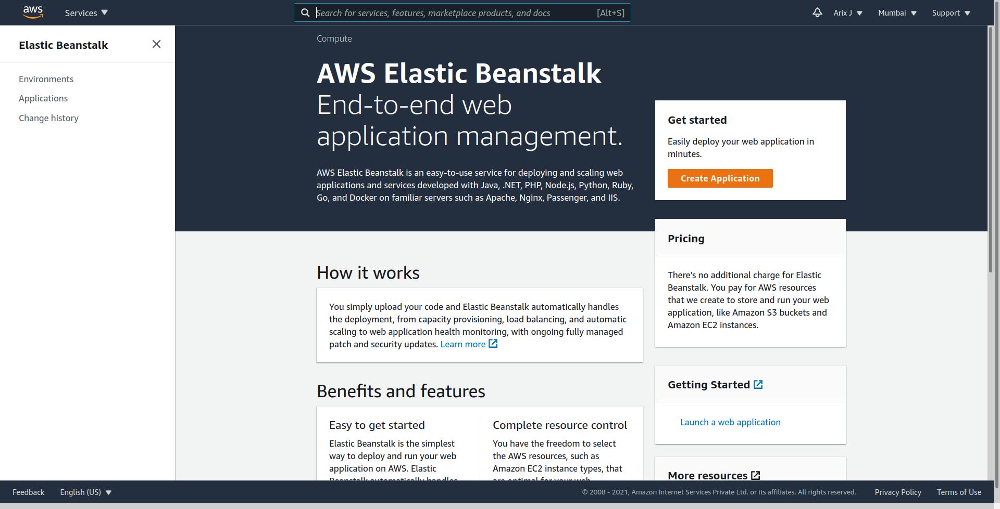
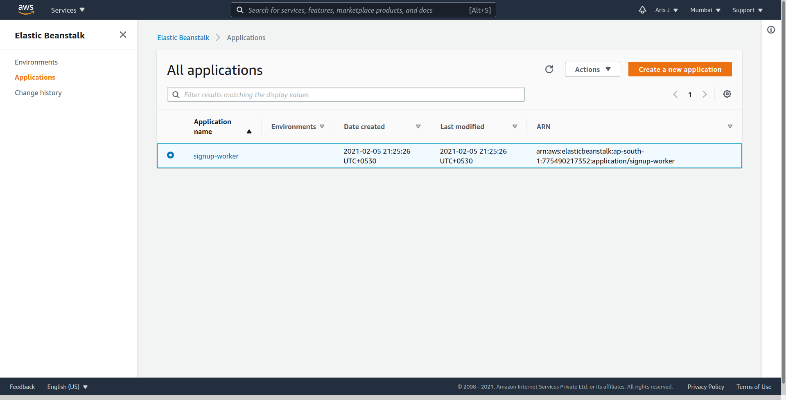
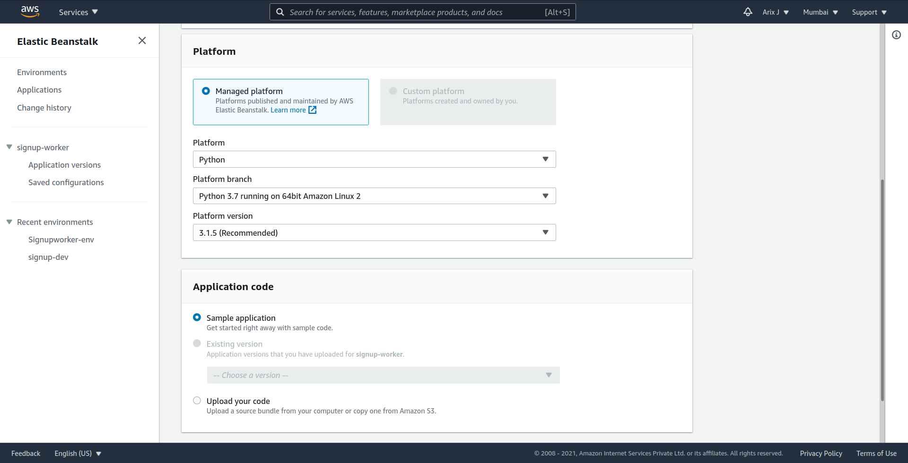
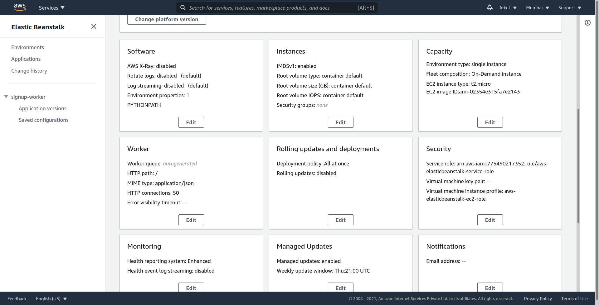
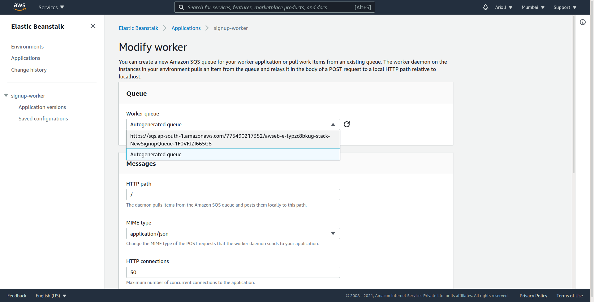
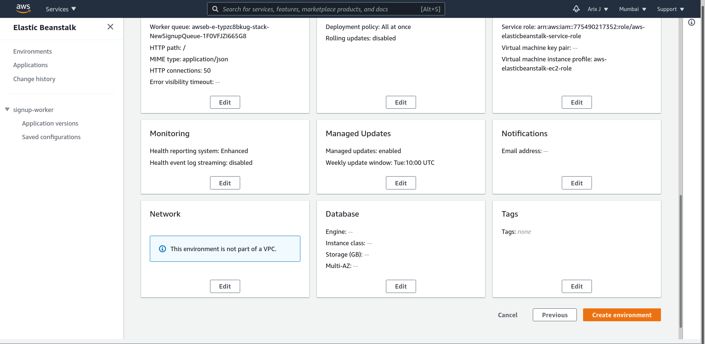
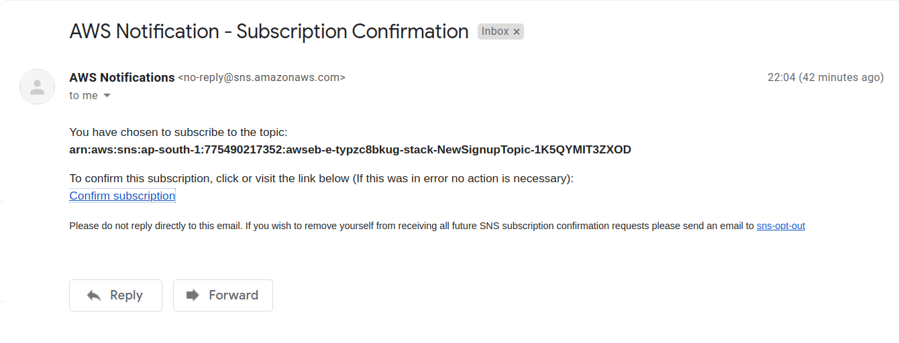

# Signup App Deployment on AWS Elastic Bean Stalk Environment

## Signup-webserver
This Python sample application uses the Flask framework and Bootstrap to build a simple, scalable customer signup form that is deployed to AWS Elastic Beanstalk. The application stores data in Amazon DynamoDB and publishes notifications to the Amazon Simple Notification Service (SNS) when a customer fills out the form.

## Signup-worker
This Python sample application illustrates the worker role functionality of AWS Elastic Beanstalk. It is designed to process messages generated by the frontend Signup Webserver App. Messages contain a customer's name and e-mail address, and the worker app uses SNS to deliver an e-mail to the admin when customer fills out the form.

So, Let's get started with the AWS Elastic Bean Stalk. We will see this implementation with both console and EB CLI.

First start with EB CLI, for installation of EB CLI follow the link below:  
(https://docs.aws.amazon.com/elasticbeanstalk/latest/dg/eb-cli3-install.html#eb-cli3-install.scripts)

after the EB CLI Setup clone this Repository using:  
`git clone https://github.com/Tanuljain/eb-web-and-worker-tier.git`

Now change the directory to signup-webserver using: `cd signup-webserver`

After installing the EB CLI, you are ready to configure your project directory and the EB CLI by running `eb init`. 
Now [Configure the EB CLI](https://docs.aws.amazon.com/elasticbeanstalk/latest/dg/eb-cli3-configuration.html)

**Note: EB CLI configuration requires AWS Credentials, [Understanding and getting your AWS credentials](https://docs.aws.amazon.com/general/latest/gr/aws-sec-cred-types.html#access-keys-and-secret-access-keys)**

After installing the EB CLI and configuring your project directory, you are ready to create an Elastic Beanstalk environment using the EB CLI, deploy source and configuration updates, pull logs and events. 

## Eb create
To create your first environment, run eb create and follow the prompts. If your project directory has source code in it, the EB CLI will bundle it up and deploy it to your environment. Otherwise, a sample application will be used. 

**Note: Refer [EB CLI Basics](https://docs.aws.amazon.com/elasticbeanstalk/latest/dg/eb-cli3-getting-started.html#ebcli3-basics-create)**

Let's move on to the next application which is designed to process messages generated by the frontend Signup Webserver App. 

This deployment we will using AWS management console and use second type of AWS Elastic Bean Stalk Environment Tier i.e. Worker Environment tier.
So now the question is 

## What is Worker Tier?
Worker Tier is Elastic Bean Stalk environment type that is optimized to handle background processing of tasks generated by your application. Some tasks you might want performed in background could include sending email, geerating report or resizing images by offloading background tasks to a worker environment tier you free up the web application in your web server environment to handle web requests. 

In our example, we will use worker tier to notify admin on each signup. So Let's start 

Now change the directory to signup-worker using: `cd signup-worker` with `eb init` and follow prompts. This will create application on Elastic Bean Stalk, after that for configration of worker environment go to [Elastic Beanstalk Management Console](https://console.aws.amazon.com/elasticbeanstalk)
**Note: create zip file of signup-worker directory which required at the time of creation of worker environment.** 

Click applications on sidebar menu to see the applications: 

Click on signup-worker application. There is no environment so create a new one after clicking on Create a new environment button then select worker environment tier.

In platform section choose **Python** platform 
In application section choose sample appliaction then click on **Configure more options** button. 
<!-- In application section choose upload your code and zip file of **signup-worker** directory then click on **Configure more options** button. -->

In worker section click *Edit* button, in queue section select the queue which was generated by signup-webserver app sothat worker server can process queue tasks then keep remaining same and save.

**[Optional]** If you want to add key to instances for SSH then Edit security section and add a key and save.
After configuration click **Create environment** button.

In Few minutes, environment status is Green.

After that confirm the subscription of **SNS** on email which you provide in configuration then go to [SNS Console](https://ap-south-1.console.aws.amazon.com/sns/) and select topics under topics verify the email status is **Confirmed.**

**Congratulations, Server is Ready!** 